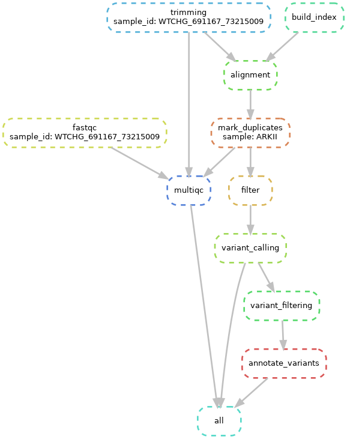

# Single sample Variant Calling pipeline

Snakemake workflow for single sample variant calling pipeline. This pipeline was designed to call variants in the WES and WGS data from **single** sample. I am planning to extend this to run for multiple sample, but that functionality is not present as of right now. 

## Authors

* Kasia Kedzierska (@kzkedzierska)  

## Steps of the pipeline



1. Quality control of the reads.
2. Reads trimming, followed by QC.
3. Aligning the reads with bwa.
4. Marking duplicate alignments.
5. Quality based filtering.
6. Calling variants.
7. Filtering variants.
8. Annotating variants.

## Prerequisites

This pipleine relies on **conda** and **snakemake**. If the pipeline is run with conda, the necessary software is automatically installed when the pipeline is run for the first time. This might generate overhead (especially if one uses a lot of pipelines). However, this adds to the reproducibility, as this should work on different machines and servers.

If conda, for some reasons is not prefferable, one needs to make sure that all the software described in the yaml files in [envs/](envs/) directory are installed and accessible to snakemake.

Roughly, the pipeline uses:

* [FastQC](https://www.bioinformatics.babraham.ac.uk/projects/fastqc/)  
* [Trim Galore](https://www.bioinformatics.babraham.ac.uk/projects/trim_galore/)  
* [MultiQC](https://multiqc.info/)  
* [BWA](http://bio-bwa.sourceforge.net/)  
* [Samtools](https://www.htslib.org/)
* [Picard](https://broadinstitute.github.io/picard/)  
* [Bedtools](https://bedtools.readthedocs.io/en/latest/index.html)  
* [Mutect2](https://gatk.broadinstitute.org/hc/en-us/articles/360037593851-Mutect2)  
* [VEP](https://www.ensembl.org/info/docs/tools/vep/index.html)


Honestly, if you need to install all those, it's better to use [conda](https://docs.conda.io/en/latest/).

## Input files

* **Sample sheet** - pipeline requires the `sample_sheet.tsv` to have at least one column with sample ids. The file can have a header line starting with a #, **AND**
* **Raw reads** - starts with raw reads which need to be stored in read/raw. The naming assumes `sample_id_[12]{1}.fastq.gz`, **OR**
* **Sorted alignment** - in case you don't have access to raw reads, you can start from the alignment step; the files need to be placed in the `alignment` directory and names `sample_id_sorted.bam`.

## Usage

Best way of setting up this pipeline is to copy the content of this directory into the directory where one wants to store the results of the pipeline. Remember to update the **config.yaml**. 

It's always good to first try the dry run.

```bash
# -n for dry run and -p for printing the shell commands
snakemake -np
```

Next, to run the pipeline with one sample and looking adt the dag. 

```bash
# print two first lines (assuming the file has a header) to new file
head -n2 sample_sheet.tsv > sample_sheet_one.tsv
# rename full sample sheet
mv sample_sheet.tsv sample_sheet_all.tsv
# soft link sample sheet with one sample
ln -s sample_sheet_one.tsv sample_sheet.tsv
#
snakemake -np --dag | dot -Tpng > dag.png
```

When successful, run the whole pipeline. Remember, when running on a cluster to have set up appropriate [profile](https://snakemake.readthedocs.io/en/stable/executing/cli.html#profiles) for execution etc. 

```bash
snakemake --jobs 16 --use-conda 
```